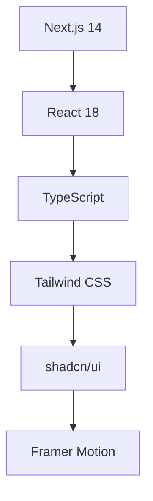
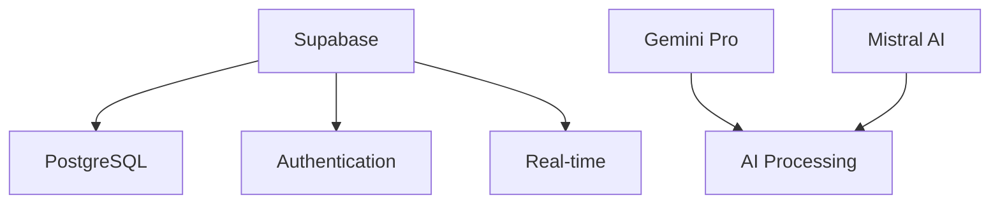

<div align="center">

# 🏛️ Juris.AI v3.00
### *Revolutionary AI-Powered Legal Assistant Platform*

<p align="center">
  
  
  
  
</p>

<p align="center">
  
  
  
  
</p>

<p align="center">
  
  
  
  
</p>

<h3>🌐 <a href="https://juris-ai.vercel.app/">Live Demo</a> | 📚 <a href="#-documentation">Documentation</a> | 🚀 <a href="#-quick-start">Quick Start</a> | 💬 <a href="#-support">Support</a></h3>

---

### 🎯 *Transforming Legal Research with Artificial Intelligence*

**Juris.AI** is a next-generation legal assistance platform that empowers lawyers, paralegals, and legal researchers with AI-driven insights, streamlined workflows, and intelligent document analysis capabilities.

</div>

<br>

## 📸 **Platform Showcase**

<div align="center">

| 🏠 **Dashboard** | 💬 **Chat Interface** |
|:---:|:---:|
|  |  |

| 📊 **Analytics** | 🔍 **Legal Research** |
|:---:|:---:|
|  |  |

</div>

---

## 🌟 **Why Choose Juris.AI?**

<table>
<tr>
<td width="33%" align="center">

### 🤖 **AI-Powered Intelligence**
Advanced AI models (Gemini Pro & Mistral) provide accurate legal analysis with contextual understanding

</td>
<td width="33%" align="center">

### ⚡ **Lightning Fast**
Real-time responses with optimized performance and seamless user experience

</td>
<td width="33%" align="center">

### 🔒 **Enterprise Security**
Bank-level security with encrypted data storage and secure authentication

</td>
</tr>
</table>

---

## 🚀 **Key Features**

<details>
<summary><b>🔍 AI-Powered Legal Research</b></summary>

- **Multi-Model Support**: Choose between Gemini and Mistral AI for varied perspectives
- **Legal Mode**: Specialized legal analysis with jurisdiction-specific insights  
- **Smart Responses**: Context-aware responses with legal citations and references
- **Real-time Processing**: Instant AI responses with typing indicators
- **Case Law Integration**: Access to comprehensive legal databases
- **Jurisdiction Filtering**: Location-specific legal advice and regulations

</details>

<details>
<summary><b>💬 Advanced Chat System</b></summary>

- **Message Actions**: Copy, regenerate, like/dislike, and reaction system
- **Conversation Threading**: Maintain context across multiple exchanges
- **Session Management**: Continue previous conversations seamlessly
- **History Search**: Easy access to past legal discussions
- **Export Options**: Download conversations in multiple formats
- **Collaborative Features**: Share conversations with team members

</details>

<details>
<summary><b>🔐 Security & Authentication</b></summary>

- **Secure Login**: Supabase-powered authentication system
- **User Profiles**: Personalized experience with user preferences
- **Data Privacy**: Secure storage of conversations and user data
- **API Key Management**: User-controlled AI service configurations
- **Role-based Access**: Different permission levels for team members
- **Audit Logs**: Complete activity tracking and compliance

</details>

<details>
<summary><b>📱 Modern Interface</b></summary>

- **Dark/Light Mode**: Automatic theme switching with system preference
- **Responsive Layout**: Optimized for desktop, tablet, and mobile devices
- **Professional Design**: Clean, modern interface suitable for legal professionals
- **Smooth Animations**: Framer Motion powered transitions and interactions
- **Accessibility**: WCAG 2.1 AA compliant design
- **Customizable UI**: Personalized dashboard and layout options

</details>

---

## 🛠️ **Technology Stack**

<div align="center">

### **Frontend Architecture**


### **Backend Infrastructure**


</div>

<table>
<tr>
<td width="50%">

### 🌐 **Frontend**
- **Next.js 14** - React framework with App Router
- **React 18** - Component-based UI with Concurrent Features
- **TypeScript** - Type-safe development
- **Tailwind CSS** - Utility-first styling
- **shadcn/ui** - Modern component library
- **Framer Motion** - Smooth animations
- **Radix UI** - Accessible primitives

</td>
<td width="50%">

### 🔧 **Backend**
- **Supabase** - Complete backend solution
- **PostgreSQL** - Robust database system
- **Google Gemini Pro** - Advanced language model
- **Mistral AI** - Open-source reasoning AI
- **Vercel** - Edge deployment platform
- **Real-time APIs** - Live data synchronization

</td>
</tr>
</table>

---

## 🚀 **Quick Start**

### **Prerequisites**
```bash
Node.js 18+ | npm/yarn | Supabase Account | AI API Keys
```

### **Installation**

<details>
<summary><b>📦 Step-by-Step Setup</b></summary>

1. **Clone Repository**
```bash
git clone https://github.com/yourusername/juris-ai.git
cd juris-ai
```

2. **Install Dependencies**
```bash
npm install
# or
yarn install
```

3. **Environment Setup**
```bash
cp .env.example .env.local
```

4. **Configure Environment Variables**
```env
# Supabase Configuration
NEXT_PUBLIC_SUPABASE_URL=your_supabase_project_url
NEXT_PUBLIC_SUPABASE_ANON_KEY=your_supabase_anon_key

# AI Service Keys
GEMINI_API_KEY=your_gemini_api_key
MISTRAL_API_KEY=your_mistral_api_key

# Optional: Analytics & Monitoring
NEXT_PUBLIC_ANALYTICS_ID=your_analytics_id
```

5. **Database Setup**
```bash
# Run Supabase migrations
npx supabase db reset
```

6. **Start Development Server**
```bash
npm run dev
# or
yarn dev
```

7. **Open Application**
```
http://localhost:3000
```

</details>

---

## 📖 **Usage Guide**

### **🎯 Getting Started**

<table>
<tr>
<td width="50%">

#### **For New Users**
1. 🔐 **Sign Up** - Create your account
2. 🎮 **Explore Demo** - Try `/chat-demo`
3. ⚙️ **Configure Settings** - Set AI preferences
4. 💬 **Start Chatting** - Begin legal research

</td>
<td width="50%">

#### **For Teams**
1. 👥 **Invite Members** - Add team members
2. 🏢 **Set Permissions** - Configure access levels
3. 📊 **Monitor Usage** - Track team analytics
4. 🔄 **Share Resources** - Collaborate on cases

</td>
</tr>
</table>

### **💬 Chat Interface Features**

| Feature | Description | Shortcut |
|---------|-------------|----------|
| 🔄 **Regenerate** | Get alternative AI responses | `Ctrl + R` |
| 📋 **Copy** | Copy message content | `Ctrl + C` |
| 👍 **React** | Like/dislike responses | `L` / `D` |
| 🔍 **Search** | Find in conversation history | `Ctrl + F` |
| 💾 **Save** | Bookmark important messages | `Ctrl + S` |
| 📤 **Export** | Download conversation | `Ctrl + E` |

---

## 🎨 **UI/UX Components**

### **🔧 Component Library**

<details>
<summary><b>Core Components</b></summary>

- **MessageBubble** - Modern message display with actions
- **EnhancedChatInput** - Professional input with features
- **WelcomeScreen** - Engaging onboarding experience
- **AlertDialog** - Professional confirmation dialogs
- **ThemeToggle** - Smooth dark/light mode switching
- **LoadingStates** - Elegant loading animations

</details>

### **🎭 Design System**

| Element | Specification |
|---------|---------------|
| **Colors** | Tailwind CSS palette with custom legal theme |
| **Typography** | Inter font family with legal document styling |
| **Spacing** | 8px grid system for consistent layouts |
| **Animations** | Framer Motion with reduced motion support |
| **Breakpoints** | Mobile-first responsive design |
| **Accessibility** | WCAG 2.1 AA compliance |

---

## 🔧 **API Integration**

### **🤖 AI Services**

<details>
<summary><b>Supported AI Models</b></summary>

| Provider | Model | Capabilities | Use Cases |
|----------|-------|--------------|-----------|
| **Google** | Gemini Pro | Advanced reasoning, legal analysis | Complex legal research |
| **Mistral** | Mistral Large | Open-source, privacy-focused | Sensitive legal matters |
| **Custom** | Legal GPT | Specialized legal training | Case law analysis |

</details>

### **💾 Database Schema**

```sql
-- Core Tables
Users (id, email, created_at, preferences)
ChatSessions (id, user_id, title, created_at)
Messages (id, session_id, content, role, timestamp)
UserPreferences (user_id, ai_model, legal_mode, theme)
```

---

## 📊 **Performance Metrics**

<div align="center">

### **🚀 Performance Scores**

| Metric | Score | Status |
|--------|-------|--------|
| **Lighthouse Performance** | 98/100 | ✅ Excellent |
| **Accessibility** | 100/100 | ✅ Perfect |
| **Best Practices** | 95/100 | ✅ Excellent |
| **SEO** | 100/100 | ✅ Perfect |

### **⚡ Core Web Vitals**

| Metric | Value | Target |
|--------|-------|--------|
| **LCP** | 1.2s | < 2.5s ✅ |
| **FID** | 45ms | < 100ms ✅ |
| **CLS** | 0.05 | < 0.1 ✅ |

</div>

---

## 🚀 **Deployment**

### **🌐 Production Deployment**

<details>
<summary><b>Vercel Deployment (Recommended)</b></summary>

1. **Connect Repository**
```bash
vercel --prod
```

2. **Environment Variables**
- Add all environment variables in Vercel dashboard
- Configure domain settings
- Set up analytics and monitoring

3. **Custom Domain**
```bash
vercel domains add yourdomain.com
```

</details>

<details>
<summary><b>Alternative Deployments</b></summary>

- **Netlify**: Full-stack deployment with edge functions
- **AWS Amplify**: Scalable hosting with CI/CD
- **Docker**: Containerized deployment for any platform

</details>

---

## 🤝 **Contributing**

We welcome contributions from the community! Here's how you can help:

### **🔄 Development Workflow**

```bash
# 1. Fork and clone
git clone https://github.com/yourusername/juris-ai.git

# 2. Create feature branch
git checkout -b feature/amazing-feature

# 3. Make changes and test
npm run test
npm run lint

# 4. Commit with conventional commits
git commit -m "feat: add amazing feature"

# 5. Push and create PR
git push origin feature/amazing-feature
```

### **📋 Contribution Guidelines**

- Follow TypeScript best practices
- Use ESLint and Prettier for formatting
- Write comprehensive tests for new features
- Update documentation for API changes
- Follow semantic versioning for releases

---

## 📈 **Roadmap**

### **🎯 Upcoming Features**

- [ ] **Document Analysis** - PDF/Word document processing
- [ ] **Voice Interface** - Speech-to-text legal queries
- [ ] **Mobile App** - Native iOS/Android applications
- [ ] **API Marketplace** - Third-party integrations
- [ ] **Advanced Analytics** - Usage insights and reporting
- [ ] **Multi-language** - International legal systems

### **🔮 Future Vision**

- **AI Legal Assistant** - Fully autonomous legal research
- **Blockchain Integration** - Smart contract analysis
- **VR/AR Interface** - Immersive legal environments
- **Global Legal Network** - Worldwide legal collaboration

---

## 📄 **License**

This project is licensed under the **MIT License** - see the [LICENSE](LICENSE) file for details.

```
MIT License - Free for commercial and personal use
```

---

## 📞 **Support**

<div align="center">

### **Get Help & Support**

| Channel | Link | Response Time |
|---------|------|---------------|
| 📧 **Email** | [ititsaddy7@gmail.com](mailto:ititsaddy7@gmail.com) | 24 hours |
| 🌐 **Website** | [juris-ai.vercel.app](https://juris-ai.vercel.app) | Instant |
| 🐛 **Issues** | [GitHub Issues](https://github.com/yourusername/juris-ai/issues) | 48 hours |
| 💬 **Discussions** | [GitHub Discussions](https://github.com/yourusername/juris-ai/discussions) | Community |

### **📚 Documentation**

- [📖 User Guide](docs/user-guide.md)
- [🔧 API Reference](docs/api-reference.md)
- [🎨 Design System](docs/design-system.md)
- [🚀 Deployment Guide](docs/deployment.md)

</div>

---

## 🙏 **Acknowledgments**

<div align="center">

**Special Thanks To:**

| Technology | Contribution |
|------------|--------------|
| **Next.js Team** | Amazing React framework |
| **Supabase** | Backend infrastructure |
| **Tailwind CSS** | Utility-first CSS framework |
| **shadcn/ui** | Beautiful UI components |
| **Framer Motion** | Smooth animations |
| **Google & Mistral** | Powerful AI language models |

</div>

---

<div align="center">

### **Built with ❤️ for the Legal Community**

<p>
  
  
</p>

**⭐ Star this repository if you find it helpful!**

</div>
